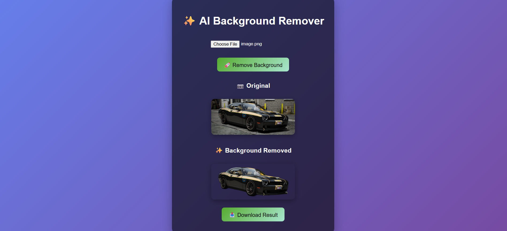

# 🎨 Advanced AI Background Remover (Exhibition Edition)

A modern **AI-powered background remover** built with **Rembg (U²-Net)** and a **custom HTML/JS front-end**.  
This project is designed for **exhibitions and demo environments** — simple to run, works offline, and produces professional-quality results instantly.  

---

## ✨ Features
- 🧠 **AI-Powered Background Removal** using U²-Net via Rembg  
- ⚡ **Offline Support** – works without internet after setup  
- 🎯 **Simple UI** – upload an image or drag-and-drop  
- 📷 **Side-by-Side Preview** (Original vs Processed)  
- 📥 **One-Click Download** of background-removed images  
- 🎨 **Responsive and Modern UI** for demo screens  

---

## 🛠 Technologies Used
- **Frontend:** HTML5, CSS3, Vanilla JavaScript  
- **Backend AI Engine:** [Rembg](https://github.com/danielgatis/rembg) (U²-Net deep learning model)  
- **Python Libraries:**  
  - `rembg` – AI background remover  
  - `onnxruntime` / `onnxruntime-gpu` – inference engine (CPU/GPU)  
  - `pillow` – image processing  
  - `numpy` – numerical operations  
  - `fastapi` + `uvicorn` – local API server  

---

## 📋 Requirements
- **Operating System:** Windows / Linux / macOS  
- **Python Version:** 3.10 or 3.11 (⚠️ Python 3.12 is not fully supported)  
- **Browser:** Any modern browser (Chrome, Edge, Firefox, etc.)  

---

## ⚡ Setup Guide

### 1. Install Python
Download and install **Python 3.10.11**:  
👉 [Python 3.10.11 Download](https://www.python.org/downloads/release/python-31011/)  

During installation:  
- ✅ Select **Add Python to PATH**  
- ✅ Select **Install for all users**  

Verify installation:
```bash
python --version
```

Expected Output:
```bash
Python 3.10.11
```
### 2. Create Virtual Environment (Recommended)
```bash
python -m venv venv
venv\Scripts\activate   # On Windows
source venv/bin/activate # On Linux/Mac
```
### 3. Install Dependencies
Upgrade pip and setuptools:
```bash
python -m pip install --upgrade pip setuptools wheel
```
Install required dependencies(🔴 Those who don't have a dedicated graphic card):
```bash
pip install rembg[cli] onnxruntime pillow numpy fastapi uvicorn
```
👉 For NVIDIA GPU acceleration(⚠️ If you have a powerful nvidia graphic card):
```bash
pip install rembg[cli] onnxruntime-gpu pillow numpy fastapi uvicorn
```
### 4. Run the Local AI Server
```bash
rembg s
```
If successful:
```bash
INFO:     Started server process [10904]
INFO:     Waiting for application startup.
INFO:     Application startup complete.
INFO:     Uvicorn running on http://0.0.0.0:7000
```
Keep this terminal open.(⚠️ IP and server process number maybe differ in your device)
### 5. Open the Frontend

1. Open ```advanced_bg_remover.html ``` in your browser.
2. Upload or drag-and-drop an image.
3. Click Remove Background.
4. Preview original vs result side by side.
5. Click Download Result to save as PNG.

---

###📷 Screenshots



---

### 🚀 Usage Flow

1. Open the Command prompt of Windows via Administration mode
2. Start the server by type ```rembg s.``` and hit enter
3. Open the HTML app in your browser.
4. Upload → Process → Download.
5. Works fully offline after setup

---

### 🔧 Troubleshooting
- Error: Missing module (onnxruntime, click, etc.)
  - Ensure Python 3.10 or 3.11 is installed.
  - Run:
    ```bash
      pip install -r requirements.txt
    ```
    
- Error: ```rembg``` not recognized
  - Try:
    ```bash
    python -m rembg s
    ```
- Colored halo around edges
  - Fixed automatically by Rembg AI (U²-Net).

---

### 📦 Requirements
```requirements.txt``` for quick setup(CPU Version):
- rembg[cli]
- onnxruntime
- pillow
- numpy
- fastapi
- uvicorn
  
👉 ```requirements-gpu.txt``` for GPU acceleration(If you have a Nvidia GPU):
- rembg[cli]
- onnxruntime-gpu
- pillow
- numpy
- fastapi
- uvicorn

Install with:
- For CPU setup:
  ```bash
  pip install -r requirements.txt
  ```
- For GPU setup:
  ```bash
  pip install -r requirements-gpu.txt
  ```
---

### 🤝 Contributing
  Pull requests are welcome.

  For major changes, open an issue first to discuss what you would like to change.

---

### 📜 License
This project is licensed under the MIT License.

Credits: Rembg
 for the U²-Net AI model.

see the [LICENSE](LICENSE) file for details.

---

### Credits
Developed by Omiya


